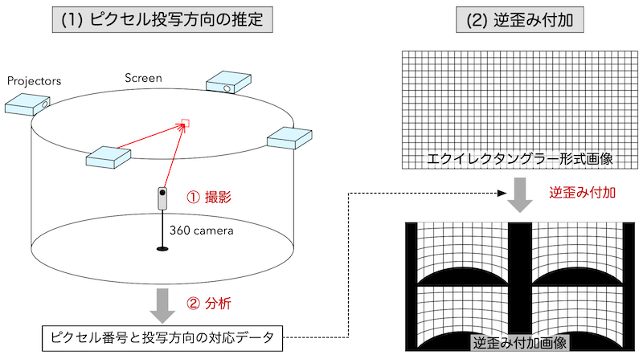
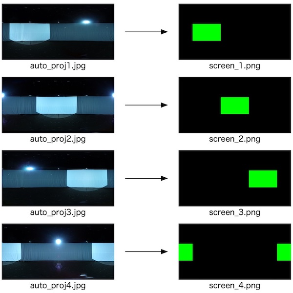

SP-mapping
==========

Spherical picture mapping.

全天球カメラ映像（静止画・動画）を，没入型ディスプレイに投影するための歪み補正を行う。


Requirments
-----------
* python3
* numpy
* scipy
* opencv-python


Equipment
---------
* Multi-Projector
	- 仮想的に単一の統合ディスプレイとして扱えること。
	- 方法：Matrox TripleHead2Go や NVIDIA MOSAIC，あるいは Blackmagic Design Teranex AV の画面分割機能など
* RICOH THETA
	- API v2.1 対応機種（S/V は動作確認済み，SC/SC2/Z1 は未確認）
	- プロジェクタ投影点位置の測定に利用する。
	- API 利用のため無線 LAN 接続をしておく。


ワークフロー
----------



マッピングの作業は大きく，(1)ピクセル投写方向推定，(2)逆歪み付加，に分けられる。
(1) では360度カメラ RICOH THETA を使って，各プロジェクタから円筒スクリーンに投写されるの各ピクセルの方向を推定する。(2)では得られた情報をもとに投写したい映像に逆歪みを付加する。


(1) ピクセル投写方向推定
----------------------

### 1. 撮影編

#### 作業フォルダ
適当な場所に作業フォルタを作成する。名前は「map_xxxx」など。ここには，各種設定ファイルや撮影画像などが保存される。逆歪み付加でも使用する。

#### ディスプレイ分割設定


* 複数のプロジェクタが，仮想敵に単一モニタとして統合されているとする。各プロジェクタがそれぞれ統合ディスプレイ上のどの区画を担当しているかを，プロジェクタ台数分の数の png ファイルでそれぞれ表現する。
* png 画像の仕様：
	- アスペクト比は，統合モニタ全体のサイズと等しくする。
	- プロジェクタの区画は，緑レイヤーに0以外の画素値の長方形領域で表現する。
	- それ以外の画素値は0にする。
	- ファイル名は`projector_#.png`とする。# にはプロジェクタの番号が入る。番号は1からナンバリングする。この番号をプロジェクタIDと呼ぶことにする。ファイルは作業フォルダに入れる。
* 各 png ファイルのアスペクト比は等しいこと。
* 区画はオーバーラップできない。

#### 撮影

THETA と Wi-Fi 接続し，以下を実行する。

```
$ python makemap -c map_xxxx
```
Mac では小さいウィンドウが現れるので，統合ディスプレイ上に移動する。Windowsでは統合ディスプレイに灰色画像が全画面表示される（別のスクリーンに表示される場合は，統合ディスプレイをメインディスプレイに設定してやり直す）。その後，いずれかのキーを押して撮影を開始する。自動的に空間コードパターンの撮影が行われ，撮影データが「map_xxxx」に保存される。


### 2. 分析編

#### 担当投写エリア設定



* 各プロジェクタが担当する投影領域に関して，プロジェクタ台数分の png ファイルで設定する。
* png 画像の仕様：
	- 正距円筒座標形式（測定に使う全天球カメラと同じ解像度が望ましい）
	- 緑レイヤー：投影領域。正距円筒図法画像上に0以上の画素値の長方形領域で表す。真上や真下をまたがる領域は設定できない。左右の境界をまたがる領域は設定できる。
	- 赤レイヤー：マスク領域。投影領域のうち，プロジェクタ投影点測定時に測定データを無効にする領域。画素値を0以上にすると，その点の計測データは無効になり，周囲のデータから推定される。カメラ三脚の影など，投影領域のうち事前に測定誤差になる箇所を塗りつぶす。
	- ファイル名は`screen_#.png`とする。# には対応するプロジェクタIDが入る。ファイルは作業フォルダに入れる。
* png ファイルはプロジェクタの台数と等しいこと。

#### オーバーラップ設定
* 複数台のプロジェクタをつなぎ合わせて表示するとき，左右の境界を目立たなくするため，画像を重ねて表示して明るさをクロスオーバーさせる。
* オーバーラップさせる幅のほかに，プロジェクタの階調特性の情報が必要である。
* 必要な情報は作業フォルダに作成した`screen_overlap.json`ファイルにより設定する。
	* `screen_overlap.json `を作成しなければ，オーバーラップは行われない。
	* `overlap_angle`において，オーバーラップ幅を角度を実数で設定する。
	* `projector_tone_curve`において，プロジェクタの階調特性の測定値を設定する。
		* `input`には，0から255のグレーのデジタル値を記述する。
		* `output`には，`input`値のグレー画像投影時のプロジェクタ出力値を記述する。この値は，照度に比例した値とする。
		* 0 と 255 の`input`値に対応する，`output`値はそれぞれ 0 と 255 となるように適当に正規化する。
		* `input`と`output`の要素数は等しいこと。

overlap_setting.json の例:

```
{
    "overlap_angle": 5,
    "projector_tone_curve": {
        "input": [0, 32, 64, 96, 128, 160, 192, 224, 255],
        "output": [0, 1.468, 3.769, 11.74, 29.33, 56.27, 88.30, 140.4, 255]
    }
}
```

* オーバーラップを行うと，`screen_#.png`緑レイヤーで設定された各スクリーンの左右のエッジの前後の画像にグラデーションがかかる。したがって，プロジェクタが実際に出力する範囲は，`screen_#.png`緑レイヤーで設定したスクリーンサイズよりも，overlap_angle / 2の分だけ左右に伸びることになる。


* 課題：プロジェクタごとの個別設定，あるいは自動設定の対応。例えば，screen_#.pngからオーバーラップ領域を自動認識するなど。

#### 分析

以下を実行する。

```
$ python makemap -a map_xxxx
```
map\_xxxx の中に mapping_table.npz というファイルが作成される。


(2) 逆歪み付加→[Go版](goconvert/README.md)
----------------------------------------


### はじめに
マッピングテーブルを元に，全天球映像をマッピングして投影用映像に変換する。

### 基本コマンド

```
$ python convert -i path2input.mp4 -d map_xxxx output_filename.mp4
```

* `-i`で，正距円筒座標形式の静止画または動画ファイルを指定する。
* `-d`で，マッピングテーブルを作成したディレクトリを指定する。
* 第一引数で，書き出すファイル名を指定する。


### オプション

#### --offset
投影像の水平回転方向のマッピング位置を調整する。単位は度。
右回転方向にシフトするには正の値をいれる。デフォルト値は 0.0 としている。

#### --edgeblur
画像上下のエッジをぼかす。指定した角度の範囲について，エッジに向けて徐々に輝度を落とす。
単位は度。デフォルト値は 0.5 としている。

#### --nframes
動画マッピング時に，先頭から何フレームに対して処理するか指定する。
設定値を 0 とすると，全フレームをマッピングする。デフォルトは 0。

#### --gamma
マッピング処理における画素値の決定にはバイリニア補間を使用している。
バイリニア補間ではリニア特性の画像が必要なので，入力画像のガンマ補正を除去する前処理を行っている。
また補間後には再びガンマ補正を施している。
補正除去では 1/Gamma のガンマカーブ，再補正では Gamma のガンマカーブを用いて，階調の変換を行う。
デフォルトで Gamma=2.2 としている。`--gamma`において，Gamma 値を変更できる。

#### --contrast
マッピング処理時に簡易的なコントラスト調整を行えるようにしている。
コントラスト調整の実態は，ガンマカーブによる階調補正で，`--contrast`により Gamma 値を設定する。
設定値を 1.0 より大きくすることで，中間輝度が暗くなる。
全方位のプロジェクタ投影では，ハレーションにより映像が白けやすい。
そのため，事前に映像のコントラストを上げることが多い。


###ヘルプ

```
$ python convert -h
usage: convert [-h] -i I -d D [--offset OFFSET] [--edgeblur EDGEBLUR]
               [--nframes NFRAMES] [--contrast CONTRAST] [--gamma GAMMA]
               filename

positional arguments:
  filename             output filename

optional arguments:
  -h, --help           show this help message and exit
  -i I                 input image or movie filename
  -d D                 path to working folder
  --offset OFFSET      Horizontal offset (default: 0.0, unit: degree)
  --edgeblur EDGEBLUR  Edge blur (default: 0.5, unit:degree)
  --nframes NFRAMES    number of frames to video convert
  --contrast CONTRAST  Contrast (default: Gamma 1.0)
  --gamma GAMMA        Gamma (default: 2.2)
```


